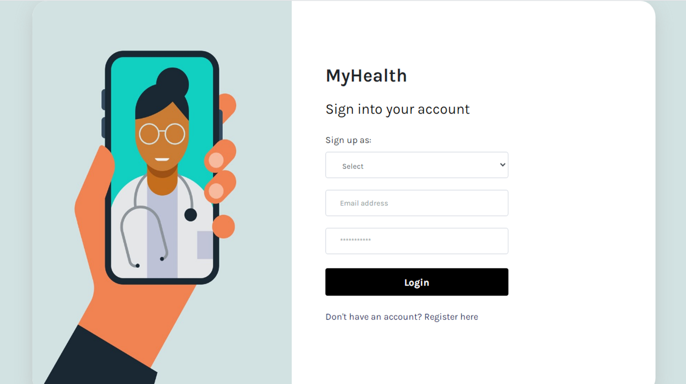

# MyHealth

## Description
MyHealth is a revolutionary Healthcare Platform that connects patients to doctors through a secure mobile platform allowing patients access to view health records from your computer, tablet or smartphone. 

You’ll now be able to create mobile accounts to view health records from previous and current visits. Not only does this app benefit patients it’s also a huge help to health care providers as well. This application connects doctors and nurses to their network of patients making accessing and updating patient information readily accessible.


## Table of Contents

* [Installation](#installation)
* [Deployment](#deployment)
* [License](#license)
* [Questions](#questions)
* [Mock-up](#mock-up)


## Installation 
The user needs to have Node.js installed. Clone the repo, run `npm i` for the dependencies. After that, create an .env file and add your database name, MySQL username, and MySQL password as follows:

 ```
 DB_NAME='MyHealth_db'
 DB_USER='your_mysql_user'
 DB_PW='your_mysql_pw'
 SESSION_SECRET='your_secret'
 ```

 Open MySQL shell and create the database typing source `db/schema.sql` and `quit`to exit the shell.
 Create a `.gitignore` file and add the following files:

 ```
 node_modules 
 .DS_Store
 .env
 ```

To start the application, run:
`npm start`. 

## Deployment
Find the deployed website [here](.... .herokuapp.com/).


## License


## Questions
If you have any questions about this project, send me an email at lizethariasc14@gmail.com or contact us through our GitHubs:
 [Liz Arias](https://github.com/lizariasc)
 [Inara Nyingifa](https://github.com/inara-nyingifa).
 [Araceli ](https://github.com/Araceli4690).

## Mock-up
